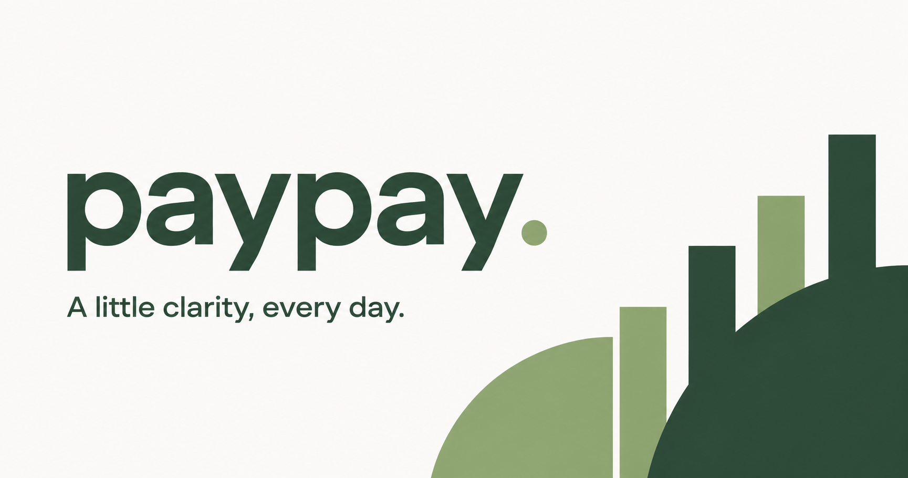
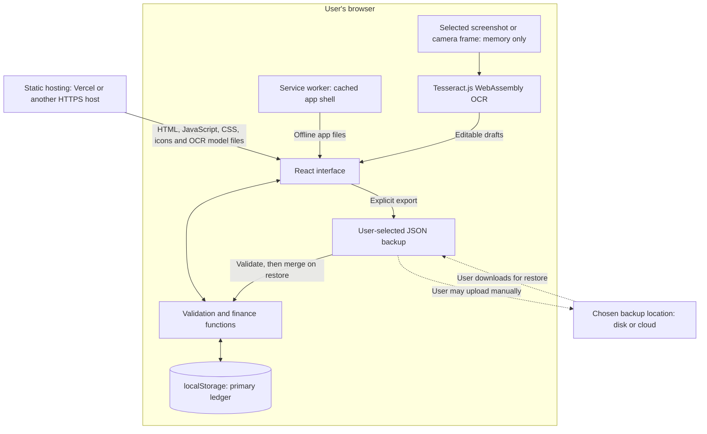

# Paypay

### A little clarity, every day.

A personal finance tracker for university life, freelance work, internships, and everything in between. Built for quick entries on a phone, with a quiet interface and a ledger that stays in the user's browser.



**Next.js 16.2 · TypeScript · Tailwind CSS · Framer Motion · shadcn/ui**

[Why I built it](#why-i-built-paypay) · [Features](#what-it-does) · [Architecture](#architecture) · [Privacy](#privacy-and-backup) · [Run locally](#run-locally) · [Deploy](#deploy-on-vercel)

## Why I built Paypay

As a university student, freelancer, and intern, I wanted one place to record the different sides of my finances: everyday spending, student allowances, freelance payments, and internship income.

My goal was straightforward: open a website on my phone, record an entry in a few seconds, and understand where my money is going. I wanted the interface to feel spacious and considered, so tracking money could become a small daily habit.

Privacy and cost shaped the brief from the beginning. A personal finance tracker handles sensitive information, but recording a lunch expense does not require a bank connection, a remote database, or a recurring storage subscription. I wanted the application to work with only the data and access its core task actually needs.

That led to three product priorities:

- **Low effort:** quick entry, useful defaults, and controls that work on a phone.
- **A clear picture:** income and expenses organized around the different areas of my life.
- **User control:** local records, explicit exports, and recovery without making a cloud account mandatory.

## What it does

| Capability | Current implementation |
| --- | --- |
| Daily tracking | Add, edit, and delete income or expenses with a date, description, category, and optional note. |
| Different areas of life | Organize entries under Personal, University, Freelance, or Internship. |
| Monthly overview | See recorded income, expenses, and net cashflow, with weekly charts and category breakdowns. |
| Spending plans | Set a separate spending limit for each month and see the amount remaining or exceeded. |
| Search and filters | Find entries by text, type, category, area of life, and month or all time. |
| On-device OCR import | Read MAE or TNG transaction screenshots and receipt photos in the browser, then review editable drafts before saving. |
| Receipt totals | Detect a receipt and propose only its labelled final total, excluding item prices, subtotal, tax, cash, and change lines. |
| Flexible categories | Type a new category when recognition or the built-in suggestions do not fit; saved categories become reusable suggestions. |
| Backup and transfer | Export a JSON backup, validate and merge an imported backup, or export transactions as CSV. |
| Phone access | Responsive navigation and a web app manifest for home-screen installation in supported browsers. |
| Offline use | Cache the production app shell after an online visit; keep recording entries locally. |
| Sample view | Explore example data without adding it to the real ledger. |

**Try it:** run the app locally or deploy it, then choose **Preview sample** to explore a populated dashboard. The real ledger starts empty.

## Architecture

Paypay uses a static Next.js export. The hosting platform delivers the application files; normal transaction entry and financial calculations happen in the browser.



The dotted cloud path is a **manual file workflow**, not an implemented cloud integration. No transaction API, remote ledger database, bank integration, or automatic device synchronization is required.

### Why these choices?

| Decision | Reason | Trade-off |
| --- | --- | --- |
| Next.js App Router with static export | Provides a structured React project, metadata support, and portable static output without needing a transaction server. | Server-dependent features would require a separate design. |
| Browser `localStorage` | Fits the initial, small, device-local ledger and persists it across ordinary browser sessions. | Synchronous, capacity-limited, and dependent on browser storage being available. |
| Integer cents | Keeps amounts and totals out of floating-point decimal arithmetic. | Supported currencies use a fixed two-decimal representation; currency conversion is outside the scope. |
| Shared validation functions | Entry forms, imports, persistence, and optional agent tools use the same transaction rules. | Validation protects data shape, not against a compromised browser. |
| Versioned JSON backups | Makes records portable and allows the whole import to be checked before saving. | Users must keep backups; there is no automatic recovery service. |
| A separate offline app cache | Keeps application files available without duplicating the ledger into the service worker cache. | Installation and offline readiness depend on browser support and a successful initial visit. |
| Tesseract.js in WebAssembly | Keeps receipt and transaction screenshot recognition in the browser. OCR workers, cores, and English model data are copied into the static build instead of loaded from a third-party CDN. | The first scan downloads sizeable OCR files from the Paypay host, recognition can take time on older phones, and every result still needs review. |
| Tailwind CSS and shadcn/ui | Provide consistent styling and reusable interaction primitives. | Accessibility still requires integration testing; using a component library is not a substitute for it. |
| Framer Motion and Recharts | Add restrained transitions and readable financial summaries. Motion respects the user's reduced-motion preference. | These libraries add client-side code, so they are used for specific interface needs. |

The ledger is stored under `paypay.ledger.v1`. Its versioned structure contains the currency, transactions, and month-specific budgets. Finance and storage logic live in [`lib/finance.ts`](lib/finance.ts), separately from the interface in [`components/finance-app.tsx`](components/finance-app.tsx).

## Privacy and backup

### Local data is the default

Paypay's application code does not upload financial records during normal use. There is no analytics integration, bank authorization, or cloud-storage permission request in the current app. Hosting the website in the cloud is separate from storing the user's ledger there.

OCR follows the same boundary. A chosen screenshot or live camera frame stays in browser memory, is passed to the local WebAssembly worker, and is discarded after review. The source image and raw recognized text are not written to the ledger. Only drafts the user explicitly approves become local transactions. Camera access is requested only when the user opens the live camera; the system camera file option lets the operating system handle capture instead.

Browser storage is scoped to an origin, so a different domain, port, browser profile, or device has a separate ledger. This behavior is documented in [MDN's Web Storage overview](https://developer.mozilla.org/en-US/docs/Web/API/Web_Storage_API).

### How least privilege informs the design

[NIST describes least privilege](https://csrc.nist.gov/glossary/term/least_privilege) as limiting access to what is necessary for a task. For Paypay, that means asking which component needs access to which information before introducing another service or permission.

- Recording an expense does not need access to a bank account.
- Calculating a monthly total does not need a remote database.
- Restoring a backup needs the file the user selects, not general access to their filesystem or cloud drive.
- A future cloud backup feature should receive only the access needed to store and retrieve that user's backup.

Keeping records local is primarily a **data-minimization decision** that supports this direction. It does not, by itself, prove that the entire application enforces least privilege.

### Cloud storage should be a backup, not a prerequisite

The architectural intention is for the browser ledger to remain the primary working copy. Cloud storage, if introduced, should serve an optional recovery purpose rather than become a dependency for every entry.

**Available now:** download a JSON backup and store it wherever you choose, including a cloud folder you manage yourself. Paypay does not receive access to that cloud account. Current JSON and CSV exports are **unencrypted**, so uploading them may expose their contents to the chosen provider or anyone with access to the file.

**Future design, not yet implemented:** an opt-in cloud backup integration should:

1. Encrypt the backup on the client before upload, with an explicit key-recovery design.
2. Request the narrowest provider-supported scope, ideally a dedicated app folder or selected backup file.
3. Upload only the backup needed for the action the user authorized.
4. Provide clear controls for backup, restore, disconnection, and permission revocation.
5. Keep ordinary tracking usable when cloud access is unavailable or revoked.

This combines backup availability with limited access. Merely putting a backup in the cloud does not establish least privilege; permission scope and access boundaries are what matter.

### The limits of this approach

Local storage is not an encrypted vault. Same-origin JavaScript can access the ledger, so an XSS flaw, compromised dependency, or malicious app update could expose it. Someone with access to an unlocked browser profile may also be able to read the data. The host remains part of the trust model because it delivers the code, and it can observe ordinary website requests even though the app does not send it the ledger.

Clearing browser data, using private browsing, or losing a device can remove records. Browser storage also has quotas and can fail; see [MDN's storage limits and eviction guidance](https://developer.mozilla.org/en-US/docs/Web/API/Storage_API/Storage_quotas_and_eviction_criteria). Regular backups are part of the workflow, not a guarantee supplied by the hosting platform.

## Handling data carefully

The implementation includes several safeguards around ordinary mistakes and recovery:

- **Validate before saving.** Amounts, real calendar dates, categories, areas of life, IDs, and backup structure are checked.
- **Review recognition before import.** OCR results remain editable drafts until the user selects and imports them. Receipt detection returns at most one labelled final-total draft.
- **Report failed writes.** A storage failure does not silently report a saved transaction; the entry form remains available.
- **Preserve unreadable data.** A failed initial read does not automatically replace the saved ledger with an empty one. Settings offers a recovery copy before an explicit replacement restore.
- **Merge predictably.** Existing records win when transaction IDs match, and existing monthly budgets win over imported ones. Backups with a different currency cannot merge into a populated ledger.
- **Keep examples separate.** Sample transactions are generated for display and never persisted as real entries.
- **Handle CSV text.** Exported fields are quoted, and leading spreadsheet-formula characters are guarded.

These measures support data integrity and recovery. They are not a claim of formal security certification.

## Interface direction

The visual brief was minimalist and spacious: warm off-white surfaces, forest green accents, muted category colors, and clear numerical hierarchy. The main action stays close to the monthly overview, and mobile navigation keeps entry creation within reach.

The interface is organized around useful questions: What came in? What went out? What is left in the budget? Which area of life does this entry belong to? The scan flow adds one more deliberate question before saving: did the image get every detail right?

## Run locally

Requires **Node.js 22.13 or newer** and npm.

```sh
git clone https://github.com/Jaydenteh-9003/paypay.git
cd paypay
npm ci
npm run dev
```

Open [localhost:3000](http://localhost:3000).

For a phone on the same Wi-Fi, use your computer's LAN IP on port 3000 if the firewall permits. The computer must remain on. Use an HTTPS deployment for phone installation and service worker support; a plain HTTP LAN preview is intended for development.

To build and serve the production files locally:

```sh
npm run build
npm start
```

The build writes the static site to `out/`. The postbuild script generates a versioned offline worker from the exported assets. The included static server uses port 3000 by default, configurable through `PORT`.

## Deploy on Vercel

1. Import this GitHub repository into Vercel.
2. Use `main` as the production branch and the repository root as the project root.
3. Keep the checked-in [`vercel.json`](vercel.json) settings: **Other** framework preset, **`npm run build`** build command, and **`out`** output directory.
4. Deploy, open the production URL on your phone, and use the browser's **Add to Home Screen** option.

The Other preset is intentional: Next.js still builds the app, while Vercel serves the complete static output, including the postbuild offline assets. No database or server function is needed.

Canonical, social-preview, and sitemap URLs use Vercel's `VERCEL_PROJECT_PRODUCTION_URL`. An explicit `NEXT_PUBLIC_SITE_URL` takes precedence for a custom domain or another host. Outside Vercel, the current fallback is the original hosted Paypay address; set the explicit URL when publishing elsewhere.

**Changing addresses does not transfer records.** Export a backup from the old address and restore it at the new one. Search-engine metadata and a sitemap help discovery, but publishing does not guarantee indexing.

## Verification

```sh
npm test
npm run typecheck
npm run build
```

The automated suites contain 14 tests covering amount parsing, calendar boundaries, persistence and edits, failed writes, backup validation, merge behavior, monthly and weekly totals, CSV escaping, receipt-final-total selection, MAE and TNG-style transaction text, date recognition, balance exclusion, and OCR import limits.

The implementation has also passed a production build and TypeScript checks. The generated offline worker was checked with a mocked cache/fetch contract, including offline navigation and retaining newly fetched assets across updates. Physical-phone installation and broad browser UI testing remain separate validation work.

An experimental, feature-detected WebMCP interface exposes `read_month_summary` and `create_transaction` through the same ledger functions. It is not required for normal use. Execution in a supported WebMCP browser has not been verified.

## Project guide

```text
app/
  page.tsx                 Application entry point
  layout.tsx               Site metadata and global layout
  globals.css              Theme and responsive styles
  robots.ts, sitemap.ts    Search-engine metadata
components/
  finance-app.tsx          Overview, entry forms, budgets, and settings
  ocr-import.tsx           Image capture, local OCR, review, and import flow
  ui/                      Shared shadcn/ui primitives
lib/
  finance.ts               Ledger model, validation, storage, and calculations
  ocr.ts                   Receipt and transaction-history text parsing
  site-url.ts              Canonical deployment origin
scripts/
  build-offline.mjs        Generate the production offline worker
  prepare-ocr-assets.mjs   Copy the OCR runtime into the static build inputs
  serve.mjs                Serve the static export locally
tests/
  finance.test.ts          Data and persistence tests
  ocr.test.ts              Synthetic receipt and bank-history parser tests
public/
  manifest.webmanifest     Installable web app metadata
  icons/                   App icons
vercel.json                Static hosting configuration
```

## What this project demonstrates

Paypay brings together product decisions, interface work, and architecture around a specific personal need:

- Translating several real-life income and spending contexts into one small workflow.
- Choosing the amount of infrastructure the problem needs, and documenting what that choice gives up.
- Treating privacy, access scope, recovery, and data portability as design decisions.
- Separating testable financial rules from presentation code.
- Delivering a mobile-oriented web app with a reproducible static deployment.

The project uses AI-assisted development. The motivation, intended workflows, visual direction, and privacy priorities come from my personal brief; the repository makes the resulting implementation and its limitations available for review.

## Next steps

- [ ] Test installation, offline recovery, and backup transfer on physical iOS and Android devices.
- [ ] Review keyboard navigation, screen-reader behavior, touch targets, and contrast across the interface.
- [ ] Add encrypted backup export with a documented recovery model.
- [ ] Explore optional cloud backup with narrowly scoped, revocable access.
- [ ] Evaluate IndexedDB if ledger size or write frequency outgrows localStorage.

Bank synchronization, automatic multi-device sync, encrypted local records, and integrated cloud backup are outside the current release. OCR is a convenience layer rather than a verified bank import, so the review step remains required. Net cashflow means recorded income minus recorded expenses; it is not a verified bank balance.
